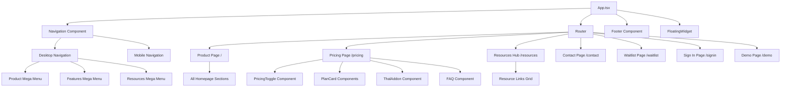
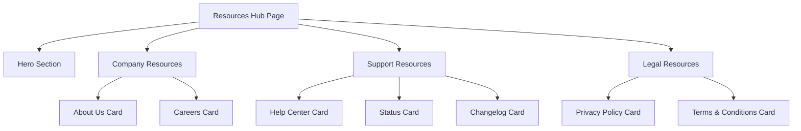

# Design Document: Website Restructure and Pricing Update

## Overview

This design document outlines the technical approach for restructuring the Olyth SaaS website to improve navigation, consolidate the homepage experience, and implement a modern 3-tier pricing model with Thal Platform Access add-on. The restructure maintains the existing React, TypeScript, Tailwind CSS, and React Router v6 technology stack while introducing significant improvements to information architecture and user journey.

### Goals

1. **Simplify Navigation**: Reduce cognitive load by consolidating navigation to 8 primary items with organized mega menus
2. **Optimize Homepage**: Replace the generic Home page with the Product page as the primary landing experience
3. **Centralize Resources**: Create a Resources Hub for secondary content (About, Careers, Help Center, etc.)
4. **Modernize Pricing**: Implement a clear 3-tier pricing structure with monthly/annual toggle and Thal Platform Access add-on
5. **Improve Conversion**: Streamline the path from discovery to trial signup with clear CTAs and Enterprise sales integration
6. **Maintain Quality**: Preserve responsive design, accessibility compliance, and performance standards

### Non-Goals

- Redesigning the visual design system or brand identity
- Implementing new backend services or authentication systems
- Creating new content pages beyond the Resources Hub
- Modifying the existing component library (shadcn/ui)
- Changing the build tooling or deployment pipeline

## Architecture

### High-Level Architecture




### System Context

The website restructure operates within the existing Olyth SaaS marketing website ecosystem:

- **Frontend**: React 18+ with TypeScript, Vite build system
- **Styling**: Tailwind CSS with custom design tokens (cream, charcoal, orange, teal, clay)
- **Routing**: React Router v6 with client-side navigation
- **UI Components**: shadcn/ui component library
- **State Management**: React hooks (useState, useEffect) for local component state
- **External Integrations**: Calendly for Enterprise sales scheduling


### Architectural Decisions

**Decision 1: Product Page as Root Route**
- **Rationale**: The Product page provides immediate value proposition and feature overview, making it more effective as a landing page than a generic "Home" page
- **Trade-offs**: Requires route migration and potential SEO considerations, but improves user engagement and conversion metrics
- **Alternatives Considered**: Keeping separate Home and Product pages, but this creates redundancy and navigation confusion

**Decision 2: Resources Hub Pattern**
- **Rationale**: Consolidating secondary content (About, Careers, Help Center, etc.) into a hub reduces navigation clutter while maintaining discoverability
- **Trade-offs**: Adds one extra click to reach secondary pages, but significantly simplifies primary navigation
- **Alternatives Considered**: Keeping all resources in footer only, but this reduces visibility and accessibility

**Decision 3: Component-Based Pricing Structure**
- **Rationale**: Breaking pricing into reusable components (PlanCard, PricingToggle, ThalAddon) enables maintainability and future extensibility
- **Trade-offs**: Slightly more complex component hierarchy, but provides better separation of concerns
- **Alternatives Considered**: Monolithic pricing page component, but this would be harder to test and modify

**Decision 4: Client-Side Price Calculation**
- **Rationale**: Annual discount calculation happens in the browser, avoiding backend dependencies and enabling instant UI updates
- **Trade-offs**: Price logic is exposed in client code, but this is acceptable for public pricing information
- **Alternatives Considered**: Server-side pricing API, but this adds unnecessary complexity for static pricing

## Components and Interfaces

### Navigation Component Redesign


**Current State**: Navigation has Product, Features, Pricing, Resources, and Contact Us with mega menus

**Required Changes**:
1. Add "Sign In" link to desktop navigation (before "Try For Free")
2. Add "View Demo" button/link to navigation
3. Ensure "Product" navigation highlights when on root path "/"
4. Update Resources mega menu to link to "/resources" hub page instead of individual pages
5. Maintain existing mega menu structure for Product and Features

**Component Interface**:

```typescript
interface NavigationProps {
  // No props needed - uses React Router hooks internally
}

interface NavLink {
  label: string;
  key: string;
  href?: string; // Optional direct link
  megaMenu?: 'product' | 'features' | 'resources';
}

interface MegaMenuItem {
  icon?: string;
  name: string;
  desc: string;
  href: string;
}
```

**Behavior**:
- Desktop: Horizontal navigation with hover-triggered mega menus
- Mobile: Hamburger menu with full-screen overlay
- Active state: Highlights current route with orange color
- Mega menus: 1.5s delay before closing on mouse leave
- Keyboard navigation: Tab, Enter, Escape support


### Product Page Component

**Purpose**: Serves as the new homepage, showcasing Olyth's core value proposition

**Component Structure**:

```typescript
// Product.tsx (renamed from Home.tsx)
export default function Product() {
  return (
    <main>
      <HeroSection />
      <PlatformOverviewSection />
      <MeetThalSection />
      <ProcessSection />
      <ImpactStatsSection />
      <TestimonialsSection />
      <PricingPreviewSection />
      <ComparisonTableSection />
      <CTAWaveSection />
    </main>
  );
}
```

**Changes Required**:
1. Rename `Home.tsx` to `Product.tsx`
2. Update route mapping in `App.tsx` to use Product component for "/"
3. No changes to section components - they remain unchanged
4. Update any internal references from "Home" to "Product"

### Resources Hub Component

**Purpose**: Centralized landing page for secondary content and resources

**Component Interface**:

```typescript
interface ResourceLink {
  name: string;
  description: string;
  href: string;
  icon?: React.ReactNode;
  category: 'company' | 'support' | 'legal';
}

export default function ResourcesHub() {
  // Renders grid of resource links organized by category
}
```


**Layout Structure**:



**Resource Links**:
- **Company**: About Us, Careers
- **Support**: Help Center, Status, Changelog
- **Legal**: Privacy Policy, Terms & Conditions

**Styling**: Card-based grid layout with hover effects, consistent with existing design system

### Pricing Component Redesign

**Current State**: Displays 4 plans (Free Trial, Basic, Professional, Enterprise) with toggle and Thal add-on

**Required Changes**:
1. Remove "Free Trial" as a separate plan card
2. Update plan names: "Olyth Basic" → "Basic", "Olyth Professional" → "Professional", "Olyth Enterprise" → "Enterprise"
3. Update feature lists to match requirements
4. Add "MOST POPULAR" badge to Professional plan
5. Update Enterprise CTA to "Talk To Sales" with Calendly integration
6. Ensure Thal Platform Access remains at $25/month (no annual discount)
7. Display "14-day free trial, no credit card required" prominently above plan cards


**Component Breakdown**:

```typescript
// PricingToggle Component
interface PricingToggleProps {
  isAnnual: boolean;
  onToggle: (isAnnual: boolean) => void;
}

// PlanCard Component
interface PlanCardProps {
  name: string;
  monthlyPrice: number;
  annualPrice: number;
  features: string[];
  isPopular?: boolean;
  ctaText: string;
  ctaAction: () => void;
  ctaVariant: 'primary' | 'secondary';
  isAnnual: boolean;
}

// ThalAddon Component
interface ThalAddonProps {
  onCTAClick: () => void;
}

// Pricing Page Component
export default function Pricing() {
  const [isAnnual, setIsAnnual] = useState(false);
  // Renders toggle, plan cards, Thal addon, and FAQ
}
```

**Pricing Data Structure**:

```typescript
const pricingPlans = [
  {
    name: 'Basic',
    monthlyPrice: 19,
    annualPrice: 17, // 10% discount
    features: [
      'Shared inbox',
      'Ticket management',
      'Knowledge base',
      'Email support',
      'Basic reporting'
    ],
    cta: 'Try For Free',
    ctaVariant: 'primary'
  },
  {
    name: 'Professional',
    monthlyPrice: 39,
    annualPrice: 35, // 10% discount
    features: [
      'Everything in Basic',
      'Advanced automation',
      'AI assistance',
      'Analytics',
      'Team collaboration',
      'API access'
    ],
    isPopular: true,
    cta: 'Try For Free',
    ctaVariant: 'primary'
  },
  {
    name: 'Enterprise',
    monthlyPrice: 88,
    annualPrice: 79, // 10% discount
    features: [
      'Everything in Professional',
      'Dedicated account manager',
      'Advanced security',
      'Custom integrations',
      'Priority support',
      'Enterprise SLA'
    ],
    cta: 'Talk To Sales',
    ctaVariant: 'secondary'
  }
];
```


### Router Configuration

**Current Routes**:
```typescript
<Routes>
  <Route path="/" element={<Home />} />
  <Route path="/contact" element={<Contact />} />
  <Route path="/waitlist" element={<Waitlist />} />
  <Route path="/signin" element={<SignIn />} />
  <Route path="/pricing" element={<Pricing />} />
</Routes>
```

**Updated Routes**:
```typescript
<Routes>
  <Route path="/" element={<Product />} />
  <Route path="/pricing" element={<Pricing />} />
  <Route path="/resources" element={<ResourcesHub />} />
  <Route path="/resources/about" element={<About />} />
  <Route path="/resources/careers" element={<Careers />} />
  <Route path="/resources/help" element={<HelpCenter />} />
  <Route path="/resources/status" element={<Status />} />
  <Route path="/resources/changelog" element={<Changelog />} />
  <Route path="/resources/privacy" element={<PrivacyPolicy />} />
  <Route path="/resources/terms" element={<TermsConditions />} />
  <Route path="/contact" element={<Contact />} />
  <Route path="/waitlist" element={<Waitlist />} />
  <Route path="/signin" element={<SignIn />} />
  <Route path="/demo" element={<Demo />} />
  <Route path="*" element={<NotFound />} />
</Routes>
```

**Migration Strategy**:
- Remove `/home` route if it exists
- Archive `Home.tsx` component (rename to `Product.tsx`)
- Add redirect from `/home` to `/` for backward compatibility (optional)
- Implement 404 page for unmatched routes


### Calendly Integration

**Purpose**: Enable Enterprise prospects to schedule sales calls directly from the pricing page

**Implementation Approach**:

```typescript
// Option 1: Inline Embed (Modal)
import { PopupModal } from 'react-calendly';

function EnterpriseCard() {
  const [isCalendlyOpen, setIsCalendlyOpen] = useState(false);
  
  return (
    <>
      <Button onClick={() => setIsCalendlyOpen(true)}>
        Talk To Sales
      </Button>
      <PopupModal
        url="https://calendly.com/olyth-sales/enterprise-demo"
        onModalClose={() => setIsCalendlyOpen(false)}
        open={isCalendlyOpen}
        rootElement={document.getElementById('root')!}
      />
    </>
  );
}

// Option 2: New Tab (Simpler, no dependencies)
function EnterpriseCard() {
  const handleSalesClick = () => {
    window.open('https://calendly.com/olyth-sales/enterprise-demo', '_blank');
  };
  
  return (
    <Button onClick={handleSalesClick}>
      Talk To Sales
    </Button>
  );
}
```

**Recommendation**: Use Option 2 (new tab) initially for simplicity, then upgrade to Option 1 (modal) if user testing shows preference for inline experience.

**Configuration**:
- Calendly URL: `https://calendly.com/olyth-sales/enterprise-demo` (placeholder)
- Event duration: 30 minutes
- Availability: Business hours in company timezone
- Pre-filled fields: Name, email, company (if available from URL params)


## Data Models

### Pricing Plan Model

```typescript
interface PricingPlan {
  id: string;
  name: 'Basic' | 'Professional' | 'Enterprise';
  monthlyPrice: number; // USD
  annualPrice: number; // USD (with 10% discount applied)
  features: string[];
  isPopular: boolean;
  cta: {
    text: string;
    action: 'waitlist' | 'sales';
    variant: 'primary' | 'secondary';
  };
}

// Example
const professionalPlan: PricingPlan = {
  id: 'professional',
  name: 'Professional',
  monthlyPrice: 39,
  annualPrice: 35,
  features: [
    'Everything in Basic',
    'Advanced automation',
    'AI assistance',
    'Analytics',
    'Team collaboration',
    'API access'
  ],
  isPopular: true,
  cta: {
    text: 'Try For Free',
    action: 'waitlist',
    variant: 'primary'
  }
};
```

### Thal Platform Access Model

```typescript
interface ThalAddon {
  name: 'Thal Platform Access';
  price: 25; // USD per month (no annual discount)
  features: string[];
  cta: {
    text: string;
    action: 'waitlist' | 'learn-more';
  };
}

const thalAddon: ThalAddon = {
  name: 'Thal Platform Access',
  price: 25,
  features: [
    'API actions',
    'Advanced RAG capabilities',
    'Custom model training'
  ],
  cta: {
    text: 'Join Waitlist',
    action: 'waitlist'
  }
};
```


### Resource Link Model

```typescript
interface ResourceLink {
  id: string;
  name: string;
  description: string;
  href: string;
  category: 'company' | 'support' | 'legal';
  icon?: React.ReactNode;
  external?: boolean; // Opens in new tab if true
}

const resourceLinks: ResourceLink[] = [
  {
    id: 'about',
    name: 'About Us',
    description: 'Learn about Olyth\'s mission and team',
    href: '/resources/about',
    category: 'company'
  },
  {
    id: 'careers',
    name: 'Careers',
    description: 'Join our growing team',
    href: '/resources/careers',
    category: 'company'
  },
  {
    id: 'help',
    name: 'Help Center',
    description: 'Documentation and guides',
    href: '/resources/help',
    category: 'support'
  },
  {
    id: 'status',
    name: 'Status',
    description: 'System health and uptime',
    href: 'https://status.olyth.com',
    category: 'support',
    external: true
  },
  {
    id: 'changelog',
    name: 'Changelog',
    description: 'Latest product updates',
    href: '/resources/changelog',
    category: 'support'
  },
  {
    id: 'privacy',
    name: 'Privacy Policy',
    description: 'How we handle your data',
    href: '/resources/privacy',
    category: 'legal'
  },
  {
    id: 'terms',
    name: 'Terms & Conditions',
    description: 'Legal terms of service',
    href: '/resources/terms',
    category: 'legal'
  }
];
```


### Navigation State Model

```typescript
interface NavigationState {
  currentPath: string;
  menuOpen: 'product' | 'features' | 'resources' | null;
  mobileMenuOpen: boolean;
  scrolled: boolean; // For sticky nav styling
}

// Managed via React hooks
const [menuOpen, setMenuOpen] = useState<string | null>(null);
const [mobileOpen, setMobileOpen] = useState(false);
const [scrolled, setScrolled] = useState(false);
```

### Billing Period State

```typescript
type BillingPeriod = 'monthly' | 'annual';

interface PricingState {
  billingPeriod: BillingPeriod;
  selectedPlan?: string;
}

// Managed via React hooks
const [isAnnual, setIsAnnual] = useState(false);

// Price calculation helper
function getDisplayPrice(plan: PricingPlan, isAnnual: boolean): number {
  return isAnnual ? plan.annualPrice : plan.monthlyPrice;
}

function getAnnualDiscount(monthlyPrice: number): number {
  return Math.round(monthlyPrice * 0.9); // 10% discount
}
```

## Correctness Properties

**No correctness properties are defined for this feature because property-based testing is not applicable.**

This feature involves UI rendering, routing configuration, and simple arithmetic operations (10% discount calculation). Property-based testing is inappropriate for:

- UI rendering and layout (use snapshot tests and visual regression tests instead)
- Configuration validation (use example-based tests instead)  
- Simple arithmetic operations (use unit tests with specific examples)
- Side-effect operations like navigation (use mock-based tests instead)

All testable behaviors are deterministic and UI-focused, making them well-suited for example-based testing as detailed in the Testing Strategy section.

## Error Handling

### Navigation Errors

**Scenario**: User navigates to non-existent route
- **Handling**: Display 404 Not Found page with navigation back to homepage
- **Implementation**: Catch-all route `<Route path="*" element={<NotFound />} />`


**Scenario**: Deprecated route accessed (e.g., `/home`)
- **Handling**: Redirect to new route or display message
- **Implementation**: 
  ```typescript
  <Route path="/home" element={<Navigate to="/" replace />} />
  ```

### Calendly Integration Errors

**Scenario**: Calendly fails to load or is blocked
- **Handling**: Provide fallback contact email or form
- **Implementation**:
  ```typescript
  const handleSalesClick = () => {
    try {
      window.open(calendlyUrl, '_blank');
    } catch (error) {
      // Fallback to contact page
      navigate('/contact?subject=enterprise-inquiry');
    }
  };
  ```

**Scenario**: User has popup blocker enabled
- **Handling**: Display message instructing user to allow popups or use contact form
- **User Message**: "Please allow popups to schedule a call, or contact us at sales@olyth.com"

### Pricing Calculation Errors

**Scenario**: Invalid price data or calculation error
- **Handling**: Display error message and fallback to monthly pricing
- **Implementation**:
  ```typescript
  function calculateAnnualPrice(monthlyPrice: number): number {
    if (!monthlyPrice || monthlyPrice < 0) {
      console.error('Invalid monthly price:', monthlyPrice);
      return 0;
    }
    return Math.round(monthlyPrice * 0.9);
  }
  ```

### Responsive Layout Errors

**Scenario**: Layout breaks on unexpected viewport sizes
- **Handling**: Use defensive CSS with min/max constraints
- **Implementation**: Test at breakpoints: 320px, 768px, 1024px, 1440px, 1920px


### Accessibility Errors

**Scenario**: Keyboard navigation fails
- **Handling**: Ensure all interactive elements have proper focus management
- **Implementation**: Use semantic HTML, ARIA labels, and test with keyboard only

**Scenario**: Screen reader cannot interpret pricing information
- **Handling**: Add ARIA labels and structured data
- **Implementation**:
  ```typescript
  <div role="region" aria-label="Pricing plans">
    <div role="article" aria-labelledby="plan-professional">
      <h3 id="plan-professional">Professional Plan</h3>
      <p aria-label="Price: $39 per month">$39/month</p>
    </div>
  </div>
  ```

## Testing Strategy

### Property-Based Testing Applicability

**Property-based testing is not applicable to this feature.**

This feature involves UI rendering, routing configuration, and simple arithmetic operations (10% discount calculation). According to property-based testing best practices, PBT is inappropriate for:

- **UI rendering and layout** - Use snapshot tests and visual regression tests instead
- **Configuration validation** - Use example-based tests instead  
- **Simple arithmetic operations** - Use unit tests with specific examples
- **Side-effect operations** (navigation, external integrations) - Use mock-based tests instead

All testable behaviors (navigation correctness, pricing calculations, responsive layout, accessibility compliance, route resolution) are deterministic and UI-focused, making them well-suited for example-based testing rather than property-based testing with randomized inputs.

### Testing Approach

This feature involves UI restructuring, routing changes, and pricing logic. Testing will focus on component behavior, navigation flows, and responsive design rather than property-based testing, as the feature primarily involves UI rendering and user interactions.

### Unit Testing

**Navigation Component Tests**:
- Renders all 8 navigation items correctly
- Highlights active route with orange color
- Opens correct mega menu on hover (desktop)
- Closes mega menu after 1.5s delay
- Opens mobile menu on hamburger click
- Navigates to correct routes on link click
- Displays "Sign In" and "Try For Free" buttons

**Pricing Component Tests**:
- Renders exactly 3 plan cards (Basic, Professional, Enterprise)
- Displays correct monthly prices ($19, $39, $88)
- Calculates annual prices with 10% discount ($17, $35, $79)
- Toggles between monthly and annual pricing
- Displays "MOST POPULAR" badge on Professional plan
- Shows "14-day free trial" message prominently
- Renders Thal Platform Access at $25/month (no discount)
- Enterprise card shows "Talk To Sales" CTA
- Basic and Professional cards show "Try For Free" CTA


**Product Page Tests**:
- Renders all 9 homepage sections in correct order
- Loads without errors when accessed via root path "/"
- Navigation highlights "Product" when on root path

**Resources Hub Tests**:
- Renders all 7 resource links
- Groups resources by category (Company, Support, Legal)
- Links navigate to correct routes
- External links open in new tab (Status page)

**Router Tests**:
- Root path "/" renders Product page
- "/pricing" renders Pricing page
- "/resources" renders Resources Hub
- "/contact", "/waitlist", "/signin" render correct pages
- "/demo" renders Demo page
- Unknown routes render 404 page
- Deprecated "/home" redirects to "/"

### Integration Testing

**Navigation Flow Tests**:
1. User clicks "Product" → lands on root path with Product page
2. User clicks "Pricing" → lands on /pricing with correct pricing display
3. User clicks "Resources" → lands on /resources hub
4. User clicks resource link → navigates to resource page
5. User clicks "Try For Free" → navigates to /waitlist
6. User clicks "Sign In" → navigates to /signin
7. User clicks "Contact Us" → navigates to /contact

**Pricing Interaction Tests**:
1. User toggles to Annual → prices update with 10% discount
2. User toggles back to Monthly → prices revert to original
3. User clicks "Try For Free" on Basic → navigates to /waitlist
4. User clicks "Try For Free" on Professional → navigates to /waitlist
5. User clicks "Talk To Sales" on Enterprise → opens Calendly (new tab or modal)
6. User clicks Thal addon CTA → navigates to /waitlist


**Responsive Design Tests**:
1. Desktop (1440px): 3-column pricing grid, horizontal navigation
2. Tablet (768px): 3-column pricing grid (may wrap), horizontal navigation
3. Mobile (375px): Vertical pricing stack, hamburger menu
4. Pricing toggle works without layout shift on all viewports
5. Mega menus display correctly on desktop, hidden on mobile
6. Mobile menu overlay covers full screen

### Accessibility Testing

**Keyboard Navigation Tests**:
- Tab through all navigation items
- Enter key activates links and buttons
- Escape key closes mega menus and mobile menu
- Focus indicators visible on all interactive elements
- Pricing toggle operable via keyboard

**Screen Reader Tests**:
- Navigation structure announced correctly
- Pricing information read in logical order
- Plan features announced as list items
- CTA buttons have descriptive labels
- Mega menu items have descriptions

**ARIA Compliance Tests**:
- Navigation has `role="navigation"`
- Mega menus have `aria-expanded` states
- Pricing cards have `aria-labelledby` for headings
- Toggle has `role="switch"` or `role="radiogroup"`
- External links have `aria-label="Opens in new tab"`

### Visual Regression Testing

**Snapshot Tests**:
- Navigation component (desktop and mobile)
- Pricing page (monthly and annual views)
- Resources Hub layout
- Product page sections
- 404 page


### Performance Testing

**Load Time Tests**:
- Product page initial render < 2 seconds
- Pricing page initial render < 2 seconds
- Resources Hub initial render < 1 second
- Route transitions < 300ms

**Bundle Size Tests**:
- Code splitting implemented for page components
- Lazy loading for below-the-fold images
- No layout shifts during price calculations (CLS < 0.1)

**Interaction Performance Tests**:
- Pricing toggle updates instantly (< 100ms)
- Navigation menu opens without lag
- Mobile menu animation smooth (60fps)

### Browser Compatibility Testing

**Target Browsers**:
- Chrome 90+ (desktop and mobile)
- Firefox 88+ (desktop and mobile)
- Safari 14+ (desktop and mobile)
- Edge 90+

**Test Scenarios**:
- Navigation works in all browsers
- Pricing calculations accurate in all browsers
- Responsive layouts render correctly
- Calendly integration works (or fallback displays)

### Manual Testing Checklist

- [ ] All 8 navigation items present and functional
- [ ] Product page serves as homepage at "/"
- [ ] Resources Hub accessible at "/resources"
- [ ] Pricing displays 3 tiers with correct prices
- [ ] Annual toggle applies 10% discount
- [ ] Thal addon shows $25/month (no discount)
- [ ] Enterprise "Talk To Sales" opens Calendly
- [ ] Free trial message visible on pricing page
- [ ] Mobile navigation works (hamburger menu)
- [ ] Keyboard navigation functional
- [ ] Screen reader announces content correctly
- [ ] No console errors or warnings
- [ ] All routes resolve correctly
- [ ] 404 page displays for unknown routes

